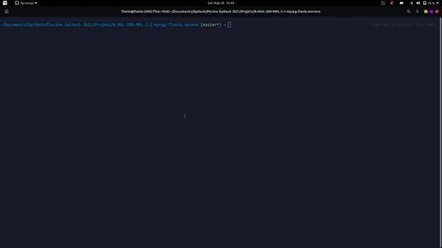

<h1 align="center">
  <br>
  <a href="https://github.com/CustomEntity/crNormz"></a>
  <br>
  crNormz
  <br>
</h1>

<h4 align="center">The most awesome norminette made
using <a href="https://crystal-lang.org" target="_blank">Crystal</a>.</h4>

<p align="center">


<a href="https://github.com/CustomEntity/crNormz/issues"></a>
<a href="https://discord.gg/ryTcYu26Gy"></a>
<a href="https://github.com/CustomEntity/crNormz/releases"></a>
</p>

<p align="center">
  <a href="#project-description">Project Description</a> •
  <a href="#installation">Installation</a> •
  <a href="#how-to-use">How to use</a> •
  <a href="#features">Features</a> •
  <a href="#credits">Credits</a>
</p>


<p align="center">
  
</p>

## Project Description

crNormz is a norm checking program developed using Crystal so that students can
check for compliance with the EPITECH standard. This standard is not yet the
best but it is intended to be in the very near future.

## Installation

To clone and run this application, you'll need [Git](https://git-scm.com)
installed on your computer. From your command line:

```bash
# Clone this repository
$ git clone https://github.com/CustomEntity/crNormz

# Go into the repository
$ cd crNormz

# Install the norminette
$ sudo ./crnormz_installer.sh

```

## How to use

```bash
# Show help
$ crnormz -h

Usage: crnormz [-fgtlh]
    -f, --ignore-file=               Ignore file from the checker
    -g, --ignore-function=           Ignore forbidden functions
    -t, --ignore-type=               Ignore errors of a specific type
    -l, --ignore-level=              Ignore errors of a specific level (Major, Minor or Info)
    -r, --raw-output                 Enables easy parsing for applications
    -h, --help                       Show this help

# Run the norminette
$ crnormz

# Run the norminette excludind all .o files
$ crnormz -f "*.o"

# Run the norminette without checking the forbidden functions (printf and scanf)
$ crnormz -g "printf,scanf"

# Run the norminette excluding all O1 rules
$ crnormz -t "O1"

# Run the norminette excluding all info level rules
$ crnormz -l "info"

# Run the norminette without text formatting
$ crnormz -r
```

## Features

<h3>⚠️ crNormz does not support comments and quotes at the moment</h3>

| Type                                                                                     |                                  Description                                   |                            State                            |
|------------------------------------------------------------------------------------------|:------------------------------------------------------------------------------:|:-----------------------------------------------------------:|
|  O1               |                          Useless file for compilation                          |    <font style="color: green; font-size: 16px;">✓</font>    |
|  O2               |                          Invalid .c file source code                           |   <font style="font-size: 16px;">🔨</font>    |
|  O3               |                  Too many functions in a file (> 5 functions)                  |    <font style="color: green; font-size: 16px;">✓</font>    |
|  O4               |                       File name not in <i>snake_case</i>                       |    <font style="color: green; font-size: 16px;">✓</font>    |
|  G1               |                      EPITECH header not found or invalid                       |    <font style="color: green; font-size: 16px;">✓</font>    |
|  G2               |                  Functions must be separated by a single line                  |    <font style="color: green; font-size: 16px;">✓</font>    |
|  G3               | Preprocessor directives must be indented according to the level of indirection |    <font style="color: green; font-size: 16px;">✓</font>    |
|  G4               |                          Global variable not constant                          |   <font style="font-size: 16px;">🔨</font>    |
|  G5               |                     Static global variables and functions                      |   <font style="font-size: 16px;">🔨</font>    |
|  G6               |             Include directive should only include header .h files              |    <font style="color: green; font-size: 16px;">✓</font>    |
|  G7               |               Line endings must be done in UNIX style (with \n)                |    <font style="color: green; font-size: 16px;">✓</font>    |
|  G8               |            No trailing spaces must be present at the end of a line             |    <font style="color: green; font-size: 16px;">✓</font>    |
|  G9               |               No more than 1 trailing empty line must be present               |    <font style="color: green; font-size: 16px;">✓</font>    |
|  F2               |                     Function name not in <i>snake_case</i>                     |    <font style="color: green; font-size: 16px;">✓</font>    |
|  F3               |                        Too many columns (> 80 columns)                         |    <font style="color: green; font-size: 16px;">✓</font>    |
|  F4               |                    Too many lines in function (> 20 lines)                     |  <font style="color: green; font-size: 16px;">✓</font>    |
|  F5               |                Too many parameters in function (> 4 parameters)                |   <font style="color: green; font-size: 16px;">✓</font>    |
|  F5               |         Missing 'void' parameter in case of function without arguments         |  <font style="color: green; font-size: 16px;">✓</font>    |
|  F6               |                           Comments within a function                           |   <font style="color: green; font-size: 16px;">✓</font>    |
|  F7               |                                Nested functions                                |   <font style="font-size: 16px;">🔨</font>    |
|  L1               |                     Multiple assignments on the same line                      |   <font style="color: green; font-size: 16px;">✓</font>    |
|  L2               |                                Bad indentation                                 |   <font style="color: green; font-size: 16px;">✓</font>    |
|  L3               |                         Missing space after a keyword                          |   <font style="font-size: 16px;">🔨</font>    |
|  L4               |                               Misplaced bracket                                |    <font style="color: green; font-size: 16px;">✓</font>    |
|  L6               |                                   Line jumps                                   |   <font style="font-size: 16px;">🔨</font>    |
|  V1               |             The type names defined with typedef should end with _t             |   <font style="font-size: 16px;">✓</font>    |
|  V1               |  All identifier names should be according to the <i>snake_case</i> convention  |   <font style="font-size: 16px;">✓</font>    |
|  V1               |              The names of macros should be written in UPPER_CASE               |   <font style="font-size: 16px;">✓</font>    |
|  V1               |              The content of enums should be written in UPPER_CASE              |   <font style="font-size: 16px;">✓</font>    |
|  V3               |                            Pointer badly positioned                            |    <font style="color: green; font-size: 16px;">✓</font>    |
|  C1               |                        Too much code depth (> 2 levels)                        |    <font style="color: green; font-size: 16px;">✓</font>    |
|  C3               |                                  Goto keyword                                  |    <font style="color: green; font-size: 16px;">✓</font>    |
|  H1               |                     Source code in header file vice versa                      |    <font style="color: green; font-size: 16px;">✓</font>    |
|  H3               |                     Macro should match only one statement                      |    <font style="color: green; font-size: 16px;">✓</font>    |
|  A3                |                       File should end with a line break                        |    <font style="color: green; font-size: 16px;">✓</font>    |
| <center></center> |                               Forbidden function                               |    <font style="font-size: 16px;">🔨</font>     |

# Credits

- [Moreno Flavio - Developer](https://github.com/CustomEntity/)
- [Kucia Guillaume - E-artsup student](https://github.com/KuciaGuillaume)