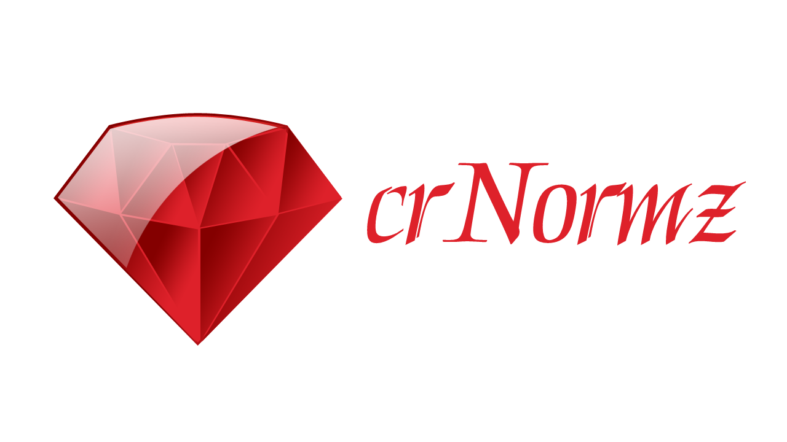

<h1 align="center">
   
  
   
  crNormz
   
</h1>

<h4 align="center">The most awesome norminette made
using <a href="https://crystal-lang.org" target="_blank">Crystal</a>.</h4>

  <a href="#project-description">Project Description</a> •
  <a href="#install">Install</a> •
  <a href="#how-to-use">How to use</a> •
  <a href="#features">Features</a> •
  <a href="#credits">Credits</a>

